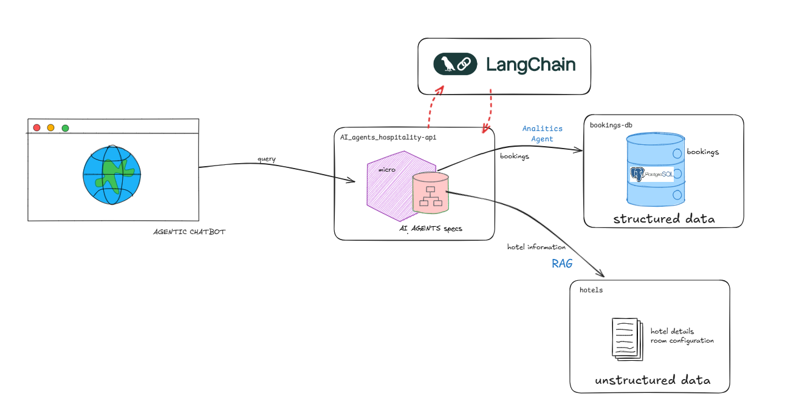

# AI Agentic PoC - Hospitality Project

This repository contains a complete Proof of Concept (PoC) for the hospitality sector using AI Agentic. The project implements a comprehensive hotel management system with specialized AI agents.

## 📚 Documentation

| Document | Description |
|----------|-------------|
| [🎓 Workshop Guide](./WORKSHOP.md) | Step-by-step workshop for building AI agents with LangChain |
| [🔧 Synthetic Data Generator](./HOWTO_generate_synthetic_data.md) | How to generate synthetic hotel and booking data |
| [🤖 AI Agents API](./ai_agents_hospitality-api/README.md) | WebSocket API for AI agent interactions |
| [🗄️ Bookings Database](./bookings-db/readme.md) | PostgreSQL database and data loader |

## 🚀 Quick Start - Launch Application

**The complete application is launched using Docker Compose. This is the recommended and primary way to run the system.**

```bash
# From the project root directory
./start-app.sh

# Or with log capture for debugging
./start-app.sh --logs

# Access the application
# URL: http://localhost:8001

# To stop the application
./stop-app.sh
```

The script will automatically:
- 🗄️ Start PostgreSQL database
- 📊 Load synthetic hotel and booking data
- 🤖 Launch AI Agents API
- 📝 Show application URLs and useful commands

## Project Overview

The Hospitality PoC is a comprehensive solution consisting of several components that are **orchestrated together via Docker Compose**:

1. **Hospitality AI Agents API** - WebSocket interface for interacting with AI agents specialized in the hotel sector
2. **Bookings Database** - PostgreSQL database and synthetic data generator for hotel bookings  
3. **Docker Compose** - **Main orchestration layer** that manages all services and provides the complete solution

### Project Structure

```plaintext
.
├── ai_agents_hospitality-api/     # AI agents API
├── bookings-db/                   # Database and data generator
├── prj-docker-compose/            # Docker Compose configuration
├── doc/                           # Project documentation and diagrams
│   ├── arq.png                    # Architecture diagram
│   └── doc.excalidraw            # Editable architecture diagram source
├── start-app.sh                   # Main startup script (run from root)
├── stop-app.sh                    # Main stop script (run from root)
└── logs/                          # Application logs
```

## Project Architecture

The Hospitality PoC project is composed of several services that work together to provide a complete AI-powered hospitality solution:

- **PostgreSQL database** containing the bookings and related data
- **Data loader service** for initializing the database with sample data
- **AI agents API** that provides intelligent booking and hospitality services
- **Integration with an AI Agentic framework** for advanced AI capabilities

Below is a visual representation of the project architecture:



## Services

### bookings-db

- **Description**: PostgreSQL database service for storing booking and hospitality data.
- **Image**: `postgres:15.3`
- **Container Name**: `bookings-db`
- **Ports**: `${POSTGRES_PORT}:5432`
- **Environment Variables**:
  - `POSTGRES_USER=${POSTGRES_USER}`
  - `POSTGRES_PASSWORD=${POSTGRES_PASSWORD}`
  - `POSTGRES_DB=${POSTGRES_DB}`

### bookings-db-data-loader

- **Description**: Service responsible for loading initial data into the database.
- **Build**: Built from the context `../bookings-db` using the `Dockerfile`.
- **Image**: `bookings-db-data-loader`
- **Container Name**: `bookings-db-data-loader`
- **Depends On**: Depends on the `bookings-db` service.
- **Environment Variables**:
  - `POSTGRES_USER=${POSTGRES_USER}`
  - `POSTGRES_PASSWORD=${POSTGRES_PASSWORD}`
  - `POSTGRES_DB=${POSTGRES_DB}`
  - `DATABASE_CONFIG_LOGGING="YES"`

### ai_agents_hospitality-api

- **Description**: AI-powered backend service for hospitality operations.
- **Build**: Built from the context `../ai_agents_hospitality-api` using the `Dockerfile`.
- **Image**: `ai_agents_hospitality-api`
- **Container Name**: `ai_agents_hospitality-api`
- **Ports**: `8001:8001`
- **Depends On**: Depends on the `bookings-db-data-loader` service.
- **Environment Variables**:
  - `ENVIRONMENT=development.localcontainer`
  - `AI_AGENTIC_API_KEY=${AI_AGENTIC_API_KEY}`
  - `POSTGRES_HOST=${POSTGRES_HOST}`
  - `POSTGRES_PORT=${POSTGRES_PORT}`
  - `POSTGRES_USER=${POSTGRES_USER}`
  - `POSTGRES_PASSWORD=${POSTGRES_PASSWORD}`
  - `POSTGRES_DB=${POSTGRES_DB}`

## Project Components

### [Hospitality AI Agents API](./ai_agents_hospitality-api/README.md)

This component implements a FastAPI WebSocket API to interact with AI agents specialized in the hospitality sector. The agents are designed to process and respond to queries about different aspects of hotel management.

**Specialized Agents Included:**

- Hotel Details Agent: Provides information about location, address, meal plans, charges, and discounts.
- Hotel Rooms Agent: Handles queries about room types, categories, pricing, and availability.
- Hotel Bookings Agent: Processes information about reservations, occupancy rates, and revenue calculations.
- Message Hotel Config Agent: Responds to queries about hotel configurations and pricing.

[See more details about the AI Agents API →](./ai_agents_hospitality-api/README.md)

### [Bookings Database](./bookings-db/readme.md)

This component provides a PostgreSQL database for hotel bookings, along with a data loader that populates the database with generated synthetic data.

**Main Features:**

- Generation of synthetic hotel and booking data
- Complete database schema for hotel and booking information
- Scripts for initial data loading
- Docker configuration for quick deployment

[See more details about the Bookings Database →](./bookings-db/readme.md)

### Docker Compose Configuration

**This is the core component that orchestrates the entire application.** All services run through Docker Compose - this is not just a deployment option, it's the primary and recommended way to use the system.

**Complete Application Stack:**

- 🗄️ **bookings-db**: PostgreSQL database service
- 📊 **bookings-db-data-loader**: Service to initialize database with synthetic data
- 🤖 **ai_agents_hospitality-api**: AI-powered backend service for hotel operations

## 🔧 Setup & Configuration

> **IMPORTANT**: Set the AI Agentic API key as an environment variable. **Never** include it in `.env` files or commit it to version control for security reasons.

```bash
export AI_AGENTIC_API_KEY=your-api-key-here
```

### Starting Services with Parameters

The project includes a script at the root level (`start-app.sh`) that automates starting the services with various configuration options:

```bash
./start-app.sh [--logs|-l] [--buildnocache|-bn] [--build|-b] [--no_ai_agent|-na] [--force|-f] [--help|-h]
```

#### Parameters:

- `--logs` or `-l`: Captures logs continuously in background mode
- `--buildnocache` or `-bn`: Performs docker-compose up with build and no cache
- `--build` or `-b`: Performs docker-compose up with build using default cache
- `--no_ai_agent` or `-na`: Starts only database services and skips the ai_agents_hospitality-api service
- `--force` or `-f`: Forces execution even if containers are already running (USE WITH CAUTION)
- `--help` or `-h`: Shows help information with all available options and examples

**Note**: 
- The script checks for running containers before executing and will prevent accidental execution if containers are already running unless `--force` is specified

#### Examples:

1. **Show Help Information:**
```bash
./start-app.sh --help
```
This displays a complete help message with all available options and usage examples.

2. **Quick Start Mode (No parameters):**
```bash
./start-app.sh
```
This starts all containers without capturing logs and returns control to your terminal.

3. **Log Capture Mode:**
```bash
./start-app.sh --logs
```
This starts all containers and continuously captures logs to a file in the background.

4. **Build with No Cache:**
```bash
./start-app.sh --buildnocache
```
This rebuilds all containers without using the cache and then starts the services.

5. **Build with Cache:**
```bash
./start-app.sh --build
```
This rebuilds all containers using the cache and then starts the services.

6. **Skip AI Agent Service:**
```bash
./start-app.sh --no_ai_agent
```
This starts only the database services without the AI agent API service.

7. **Force Execution Even If Containers Are Running:**
```bash
./start-app.sh --force
```
This forces the script to continue execution even if containers from this docker-compose configuration are already running. Use with caution as it may cause issues with running containers.

The script will:
- Start all services in detached mode
- Create a log file with timestamp in the `logs/` directory at project root (when using --logs)
- Capture logs according to the selected mode
- Automatically rotate logs when they reach 10MB
- Keep the 10 most recent log files

You can view the logs in real time with:
```bash
tail -f logs/prj_hospitality_YYYYMMDD_HHMMSS.log
```

## 🛑 Stopping the Application

Use the `stop-app.sh` script to stop the application:

```bash
# Stop containers (keep volumes)
./stop-app.sh

# Stop containers and remove volumes (deletes database data)
./stop-app.sh --remove-volumes

# Stop containers and remove images
./stop-app.sh --remove-images

# Complete cleanup (containers, volumes, images, network)
./stop-app.sh --clean-all

# Show help
./stop-app.sh --help
```

**Options:**
- `--remove-volumes, -v`: Remove volumes (database data will be lost)
- `--remove-images, -i`: Remove built images
- `--clean-all, -ca`: Complete cleanup (containers, volumes, images, and network)
- `--help, -h`: Show help information

## 📋 Application URLs

- **Main API**: http://localhost:8001
- **Database**: localhost:5432 (PostgreSQL)

## 🎓 Workshop: Building AI Agents

This project includes a complete workshop for learning how to build AI agentic applications with LangChain.

### Workshop Overview

**[📖 Full Workshop Guide →](./WORKSHOP.md)**

The workshop is divided into two exercises:

| Exercise | Topic | Description |
|----------|-------|-------------|
| **Exercise 1** | RAG for Hotel Details | Build a RAG agent to answer questions about hotels and rooms |
| **Exercise 2** | SQL Agent for Bookings | Build an SQL agent to query and analyze booking data |

### Agent Architecture

```
┌─────────────────────────────────────────────────────────────┐
│                    User Query (WebSocket)                    │
└─────────────────────────┬───────────────────────────────────┘
                          │
          ┌───────────────┴───────────────┐
          │                               │
┌─────────▼─────────┐         ┌───────────▼───────────┐
│  Hotel Config     │         │  Bookings Analytics   │
│  (RAG Agent)      │         │  (SQL Agent)          │
└─────────┬─────────┘         └───────────┬───────────┘
          │                               │
          ▼                               ▼
┌─────────────────────┐       ┌───────────────────────┐
│   Vector Store      │       │     PostgreSQL        │
│ (Hotels & Rooms)    │       │     (Bookings)        │
└─────────────────────┘       └───────────────────────┘
```

### Quick Start for Workshop

```bash
# 1. Generate synthetic data
python bookings-db/src/gen_synthetic_hotels.py

# 2. Start the mock API to test expected behavior
cd ai_agents_hospitality-api && python main.py

# 3. Access the chatbot at http://localhost:8002
```

## Requirements

- Docker and Docker Compose (**Required** - this is the only supported deployment method)
- Python 3.12+ (for workshop exercises)
- OpenAI API key (for LangChain agents)

## License

Property of Accenture. All rights reserved.
